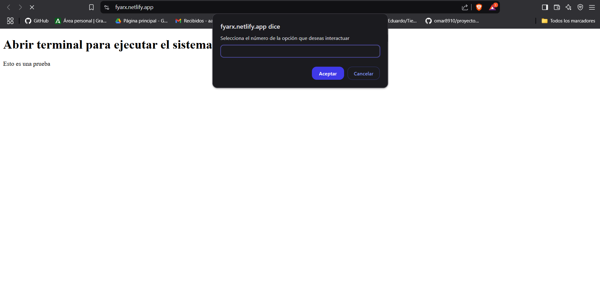
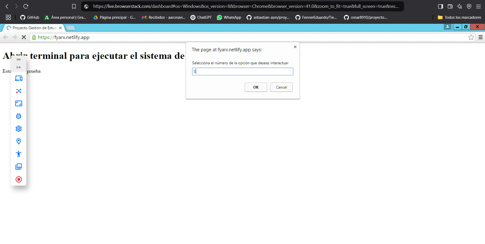
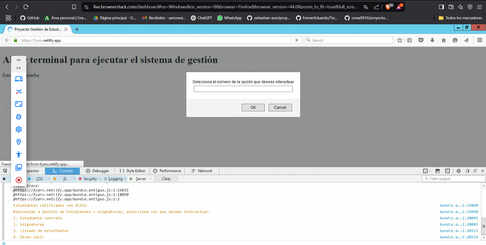

# 🔄 Polyfilling y Transpilación SGAEA 
A continuación, se explicará el proceso llevado a cabo para implementar, configurar y comprobar el funcionamiento de Node, Webpack y Babel de cara a realizar polyfill y transpilación del proyecto *SGAEA* (Sistema de Gestión Académica de Estudiantes y Asignaturas) y que este se pueda ejecutar tanto en navegadores antiguos como en modernos.

## 🍃 1. Descargar Node.js [aquí](https://nodejs.org/es) y comenzar un proyecto nuevo
Para comenzar un proyecto nuevo basta con inicializar la terminal dentro de la carpeta que vayamos a usar y ejecutar el siguiente comando:
```
npm init -y
```

## 📦 2. Instalar los paquetes necesarios 
De cara a realizar el polyfilling y transpilación del proyecto serán necesarios varios paquetes que aportarán ciertas funcionalidades que son necesarias si queremos que funcione correctamente:

```
npm install --save-dev webpack webpack-cli webpack-merge @babel/core @babel/preset-env babel-loader core-js regenerator-runtime copy-webpack-plugin cross-env html-webpack-plugin
```
Una pequeña explicación del funcionamiento de cada paquete:
* **webpack** -> Permite crear blundles de archivos de JavaScript.
* **webpack-cli** -> Concede la posibilidad de correr Webpack desde la terminal.
* **webpack-merge** -> Permite combinar configuraciones de Webpack para crear diferentes configuraciones.
* **@babel/core y @babel/preset-env** -> Configuran Babel para transpilar código moderno.
* **babel-loader** -> Carga Babel en el webpack para poder transpilarlo.
* **core-js** -> Librería que aporta polyfills para las nuevas implementaciones de JavaScript.
* **regenerator-runtime y copy-webpack-plugin** -> Proveen polyfills para funciones asíncronas.
* **cross-env** -> Permite que el programa se pueda ejecutar en varios sistemas operativos.
* **html-webpack-plugin** -> Genera un HTML con el que se puede comprobar el correcto funcionamiento en diferentes navegadores

## 🔧 3. Configuración de Webpack
Si queremos implementar Webpack en nuestro proyecto es necesario configurar 3 archivos, uno con la configuración compatible con
navegadores antiguos, uno con la de navegadores modernos y otro con una configuración común para ambos:

* `webpack.antiguo.js` -> Genera un bundle que compatibiliza el código con versiones de navegadores antiguas:
```
import path from 'path';
import { merge } from 'webpack-merge'; 
import common from './webpack.comun.js'; // Se importa la configuración común.

export default merge(common, {
    output: {
        filename: 'bundle.antiguo.js', // Crea el bundle para poder ejecutar el programa en navegadores antiguos
    },
    module: { 
        rules:  [
            {
                test: /\.js$/, 
                exclude: /node_modules/, 
                use: {
                    loader: 'babel-loader', 
                }
            },
        ],
    },
});
```

* `webpack.moderno.js` -> Genera un bundle que compatibiliza el código con versiones de navegadores actuales:
```
import path from 'path';
import { merge } from 'webpack-merge';  
import comun from './webpack.comun.js'; // Se importa la configuración común.

export default merge(comun, {
    output: {
        filename: 'bundle.moderno.js', // Crea el bundle para poder ejecutar el programa en navegadores modernos
    },
});
```

* `webpack.comun.js` -> Establece una configuración conjunta:
```
export default {
  entry: './js/main.js', // Ruta donde se encuentra nuestro programa
  output: {
    path: path.resolve(process.cwd(), 'compilado', process.env.modo), // 'compilado' es el nombre de la carpeta con los bundles
  },
  mode: process.env.modo,

  plugins: [
    new CopyWebpackPlugin({
        patterns: [
            { from: './index.html', to: '.' },  // Se indica la ruta del HTML base
        ],
    }),
],
}
```

> [!NOTE]
> El nombre de los webpacks es meramente orientativo, pero se recomienda que sean los mostrados anteriormente o similares.

## ⚙️ 4. Configuración de Babel
Se requiere la creación de un archivo llamado `babel.config.js` de cara a poder configurar Babel. Dentro de este encontraremos las directivas que se le dan a Babel para que al transpilar el código este se adapte a los navegadores que deseemos. El archivo debe de contener el siguiente código:
```
export default {
    presets: [
      [
        '@babel/preset-env', // Incluye el preset de Babel que hace posible la transpilación
        {
          targets: '> 0.25%, not dead',  // Directrices para que funcione en los navegadores deseados
          useBuiltIns: 'usage',        
          corejs: 3                    
        }
      ]
    ]
  };
```
> [!WARNING]
> Las directrices se adaptan al objetivo que se busque, puede variar respecto al usado en este proyecto.

## 🖥️ 5. Configuración del HTML
Si queremos que junto a los bundles se genere tambien un archivo .html en el que poder comprobar el correcto funcionamiento en ciertos navegadores es necesario crear un index.html en el que se realice una llamada a ambos bundles. De esta manera, cada navegador seleccionará el que se adapte a sus características y lo ejecutará. La dependencia `html-webpack-plugin` copiará el archivo que hemos creado y lo colocará en las carpetas con los bundles. El codigo a colocar en el index.html es el siguiente:
```
    <script defer type="module" src="bundle.moderno.js"></script>
    <script defer src="bundle.antiguo.js"></script>
```
> [!NOTE]
> Recueda añadir estas lineas dentro de la etiqueta **_head_** de nuestro index.html.

## ⏭️ 6. Creación de los scripts necesarios
Para simplificar el proceso de creación y ejecución de Webpack y los bundles se recomienda crear una serie de _scripts_ o atajos en nuestro `package.json`. En mi caso he creado los siguientes:
```
    "antiguo": "cross-env-shell webpack --config webpack.antiguo.js --mode $modo",
    "moderno": "cross-env-shell webpack --config webpack.moderno.js --mode $modo",
    "des": "cross-env-shell modo=development run-s antiguo moderno",
    "prod": "cross-env-shell modo=production run-s antiguo moderno",
    "clean:comp": "rimraf compilado",
    "start": "run-s clean:comp des prod"
```
* **"antiguo"** -> Crea un bundle el cual permite ejecutar el programa en navegadores antiguos.
* **"moderno"** -> Crea un bundle el cual permite ejecutar el programa en navegadores modernos.
* **"des"** -> Ejecuta "antiguo" y "moderno" en modo **desarrollo**.
* **"prod"** -> Ejecuta "antiguo" y "moderno" en modo **producción**.
* **"clean:comp"** -> Elimina la carpeta _compilado_.
* **"start"** -> Elimina la carpeta _compilado_ y genera una nueva con los cambios aplicados.

## ☑️ 7. Generación de los bundles y comprobación

El último paso es generar los bundles con el código transpilado y adaptado para cualquier tipo de navegador. Para esto nos ayudaremos del _script_ que hemos creado anteriormente llamado **"start"**, por lo que debemos escribir el siguiente codigo en la linea de comandos de la carpeta de nuestro proyecto:
```
npm run start
```
Tras esto, el _script_ eliminará la carpeta con los bundles (al ser la primera vez que lo ejecutamos no existirá ninguna, por lo que esto no se producirá) 
y crea unos nuevos con el contenido actualizado de nuestro programa principal. La estructura será esta:
* **compilado** -> Una carpeta que contiene otras dos mas, la carpeta **production** y la carpeta **development**:
    - **production** -> Contiene los bundles optimizados para producción
    - **development** -> Contiene los bundles optimizados para desarrollo

Ahora, para comprobar que el proceso se ha realizado correctamente lo idoneo es utilizar varios navegadores, tanto antiguos como modernos, 
y verificar que el programa se ejecuta sin ningun tipo de problema. Para ello se empleará la herramienta [BrowserStack](https://www.browserstack.com/), la cual se encarga
de recibir un dominio y desplegarlo en decenas de navegadores y versiones diferentes. Antes de nada es necesario subir nuestro proyecto a un dominio. Como es un proyecto que no va
a escalar lo suficiente como para adquirir un dominio de pago, se ha optado por un dominio gratuito, el cual puede obtenerse gracias a la herramienta [Netlify](https://www.netlify.com/),
para la cual hay que seguir los siguientes pasos:

* Iniciar sesión en la página.
* Vincular nuestro usuario con el de Github.
* Seleccionar la opción _"Deploy new site"_ y seleccionamos el repositorio que queremos ejecutar.
* En la opción _"Publish directory"_ elegimos la ruta de la carpeta producción creada anteriormente dentro del la carpeta compilado.
* Pulsamos sobre la opción _"Deploy site"_ para desplegar la web.



Con nuestra web ya desplegada y con un dominio el cual poder usar solo nos queda ir a BrowserStack, iniciar sesión, seleccionar el navegador que deseemos y colocar la URL de nuestro 
sitio web desplegado y si hemos seguido los pasos correctamente se nos deberia de ejecutar el programa en todos los que cumplan los requisitos que hemos indicado previamente. Para 
realizar la prueba he utilizado los siguientes navegadores:
* **Opera 28**

* **Google Chrome 41**

* **Mozilla Firefox 44**



